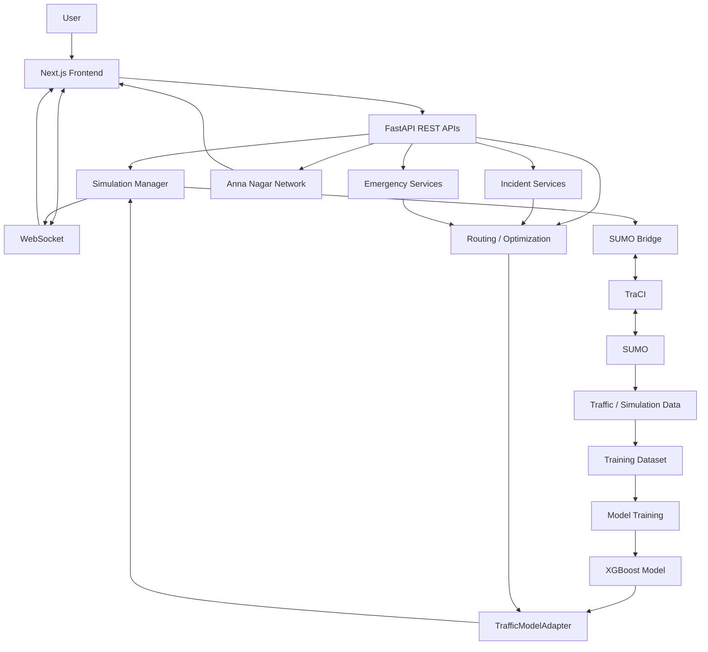
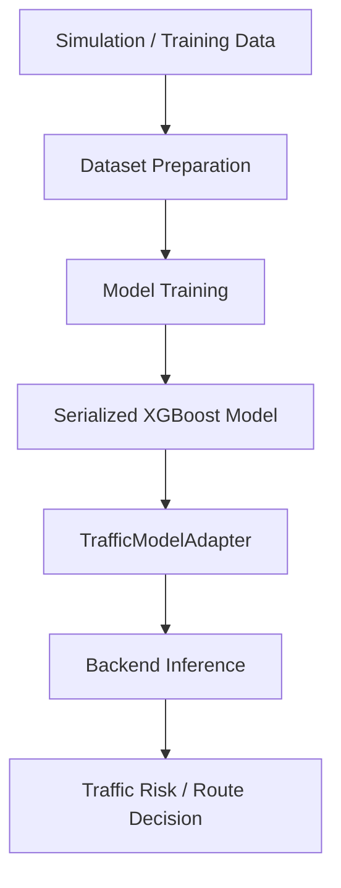

# TraffiX

### Intelligent Traffic Simulation, Risk Prediction, Route Optimization & Real-Time Navigation

[](https://github.com/santhoshraja-15/Traffix/releases/tag/v1.1.0)
[](https://www.python.org/)
[](https://fastapi.tiangolo.com/)
[](https://nextjs.org/)
[](https://eclipse.dev/sumo/)
[](https://xgboost.readthedocs.io/)
[](https://www.typescriptlang.org/)

> **TraffiX is an integrated traffic-intelligence platform connecting traffic data acquisition, SUMO simulation, machine learning, backend services, route optimization, interactive mapping, live navigation, incident handling, and emergency response — running end-to-end on the real Anna Nagar, Chennai road network.**

```
DATA → SIMULATION → LEARNING → PREDICTION → OPTIMIZATION → VISUALIZATION → NAVIGATION → EMERGENCY RESPONSE
```

---

## Table of Contents

- [Overview](#overview)
- [Problem Statement](#problem-statement)
- [Objectives](#objectives)
- [Key Features](#key-features)
- [Architecture](#architecture)
- [Data Acquisition](#data-acquisition)
- [SUMO and TraCI](#sumo-and-traci)
- [Machine Learning](#machine-learning)
- [Backend](#backend)
- [API and WebSocket](#api-and-websocket)
- [Frontend](#frontend)
- [Map and Navigation](#map-and-navigation)
- [Routing, Optimization & Dynamic Rerouting](#routing-optimization--dynamic-rerouting)
- [Incidents and Emergency Response](#incidents-and-emergency-response)
- [Technology Stack](#technology-stack)
- [Repository Structure](#repository-structure)
- [Quick Start](#quick-start)
- [Installation](#installation)
- [Configuration](#configuration)
- [Running TrafficX](#running-trafficx)
- [Demo Workflow](#demo-workflow)
- [Screenshots](#screenshots)
- [Verification and Release](#verification-and-release)
- [Team Contributions](#team-contributions)
- [Troubleshooting](#troubleshooting)
- [Limitations and Future Work](#limitations-and-future-work)
- [Contributing](#contributing)
- [Acknowledgements](#acknowledgements)
- [License](#license)

---

## Overview

TrafficX treats intelligent routing as an end-to-end engineering problem rather than only a map or shortest-path problem. It connects a real traffic simulation, a trained risk model, and a live navigation interface into one continuously-updating system running on the real Anna Nagar road network — the verified network loader reports **1,234 nodes and 3,187 edges**, while the SUMO bridge reports **3,245 discovered road edges**.

Rather than computing a route once and trusting it for the whole trip, TrafficX keeps watching the simulated network after a route is chosen — re-evaluating traffic and risk, rerouting when conditions genuinely change, detecting accidents at their real location, and automatically dispatching a simulated emergency response with a visible green corridor.

---

## Problem Statement

Static route planning breaks down the moment conditions change mid-journey — a route that was optimal at departure can become the worst option ten minutes later. TrafficX addresses this by combining simulated traffic state, learned traffic-risk information, route generation, continuous optimization, active navigation, incident handling, and emergency routing into a single system, targeting:

- congestion-aware decision making as conditions change
- route comparison across multiple live alternatives
- traffic- and risk-aware navigation, not just shortest-distance
- accurate incident impact modeling and rerouting
- automatic emergency response and green-corridor visualization
- real-time traffic visualization the user can actually trust

---

## Objectives

1. Acquire and prepare traffic data.
2. Generate realistic traffic conditions using SUMO.
3. Export simulation output for dataset creation.
4. Train traffic-risk ML models on that output.
5. Load trained models into the backend for live inference.
6. Provide REST and real-time (WebSocket) services.
7. Generate and compare multiple route alternatives.
8. Optimize route selection using live traffic/risk information.
9. Visualize the real Anna Nagar network accurately.
10. Provide live navigation with journey progress.
11. Detect accidents and propagate their impact into routing.
12. Support automatic ambulance dispatch and green-corridor visualization.
13. Deliver all of the above as one integrated, demonstrable workflow.

---

## Key Features

| Feature | Description | Status |
|---|---|---|
| Traffic data acquisition | Upstream traffic-data collection and preparation | Implemented |
| SUMO simulation | Traffic simulation and scenario execution | Implemented |
| TraCI integration | Programmatic SUMO communication | Implemented |
| Dataset generation | Simulation output prepared for ML | Implemented |
| XGBoost risk model | Persisted TrafficX model used during inference | Implemented |
| Anna Nagar network | Real road-network geometry (1,234 nodes / 3,187 edges) | Implemented |
| Interactive map | Network, route, and emergency visualization | Implemented |
| FROM/TO routing | Searchable origin/destination workflow | Implemented |
| Route comparison | Multiple alternatives with traffic/risk information | Implemented |
| Route optimization | Traffic/risk-aware route selection | Implemented |
| WebSocket updates | Real-time backend ↔ frontend state | Implemented |
| Active journey | Moving vehicle, progress, and journey KPIs | Implemented |
| Dynamic rerouting | Continuous active-route re-evaluation | Implemented |
| Accident workflow | Incident impact detection and user notification | Implemented |
| Ambulance workflow | Emergency dispatch and mission-state tracking | Implemented |
| Green corridor | Emergency-route visualization | Implemented |
| Recovery | Backend restart/reconnect and clean reload behavior | Implemented |
| Mapbox basemap | Token-based basemap rendering | Configurable |
| SVG network fallback | Real network rendering without a valid basemap token | Implemented |

---

## Architecture



### Architectural layers

| Layer | Responsibility |
|---|---|
| Data | Acquisition, preparation, and simulation-derived data |
| Simulation | SUMO execution and TraCI communication |
| ML | Model training, serialization, loading, and inference |
| Backend | APIs, simulation management, routing, and emergency services |
| Real-time | WebSocket state propagation |
| Frontend | Map, controls, navigation, and visualization |
| Decision | Route comparison, optimization, rerouting, and incident response |

---

## Data Acquisition

**Keshore G** owns the upstream data-to-training pipeline:

```
DATA ACQUISITION → SUMO SETUP → SIMULATION EXECUTION → SIMULATION DATA EXPORT
→ DATASET PREPARATION → TRAINING DATA → MODEL TRAINING
```

This covers traffic-data acquisition, dataset generation, SUMO configuration and execution, simulation-output export, ML training-data preparation, preprocessing where applicable, and training models on the acquired/generated traffic data. The exact dataset schema is treated as the source of truth in the repository's training artifacts — this README deliberately does not invent feature columns or benchmark values that aren't verified there.

---

## SUMO and TraCI

TrafficX uses **Eclipse SUMO 1.27.1** for traffic simulation and **TraCI** for programmatic communication.

### Verified network

| Property | Value |
|---|---|
| Area | Anna Nagar, Chennai |
| Network file | `scenarios/medium/osm.net.xml.gz` |
| Nodes | 1,234 |
| Application graph edges | 3,187 |
| SUMO bridge discovered edges | 3,245 |

The network loader reports 58 parallel edges skipped when building its graph representation, because an equivalent `(from, to)` junction pair was already represented.

### Runtime path

```
TrafficX → SimulationManager → SumoBridge → TraCI → SUMO → Traffic State
```

When SUMO is unavailable, the backend can enter its documented mock/fallback mode — but for full simulation behavior, SUMO must be correctly installed and discoverable on `PATH`.

---

## Machine Learning

TrafficX uses a persisted XGBoost traffic-risk model.

**Verified model artifact:** `app/ml/weights/trafficx_xgboost_v15_risk_escalation.json`

**Verified runtime status:**

| Property | Value |
|---|---|
| Model version | V15 |
| Features | 53 |
| Threshold | 0.96 |
| Status | LOADED |



**Keshore G** owns the upstream training pipeline; **Guruprasad V** owns backend-side model integration and inference. No unsupported accuracy or performance numbers are claimed here — only the verified runtime status above.

---

## Backend

TrafficX's backend is built with **FastAPI**, served through **Uvicorn**, with entry point `app.main:app`.

```
app/
├── main.py
├── core/
│   └── simulation_manager.py
├── integrations/
│   ├── sumo_bridge.py
│   └── sumo_network_loader.py
└── ml/
    ├── ml_adapter.py
    └── weights/
```

The backend coordinates application lifecycle, ML model loading/inference, simulation management, SUMO/TraCI integration, network data, route services, incidents, emergency workflows, REST APIs, and WebSockets.

**Guruprasad V** owns the complete backend and ML-integration layer.

---

## API and WebSocket

**Verified API paths:**

| Method | Endpoint | Purpose |
|---|---|---|
| `GET` | `/api/network/topology` | Anna Nagar network geometry |
| `GET` | `/api/network/locations` | Searchable road/location data |
| `POST` | `/api/simulation/start` | Initialize/start simulation |
| `GET` | `/api/emergency/hospitals` | Emergency/hospital information |
| `POST` | `/api/routes` | Route generation/comparison |
| `WS` | `/api/realtime/anna-nagar-live` | Real-time traffic/simulation state |

Additional accident, emergency, and mission services are part of the integrated application — the backend source remains authoritative for their exact contracts.

**WebSocket lifecycle:**

```
CONNECT → INITIALIZE → RECEIVE → PARSE → STORE STATE → RENDER → RECONNECT WHEN REQUIRED
```

---

## Frontend

The frontend uses **Next.js 16.3.1**, TypeScript, and Turbopack in the verified development environment.

```
frontend/
├── components/
│   └── map/
│       └── TrafficMap.tsx
├── hooks/
│   └── useWebSocket.ts
├── lib/
│   └── constants.ts
└── services/
    ├── api.ts
    └── networkApi.ts
```

Responsibilities include the interactive UI, map/network rendering, FROM/TO routing, route visualization, active navigation, real-time updates, journey progress, incident/emergency visualization, route-optimization integration, and the complete end-to-end user experience.

**Santhoshraja S** owns the frontend, integration, optimization, and final system refinement.

---

## Map and Navigation

TrafficX visualizes the real Anna Nagar road network with: road-network rendering, route geometry, origin/destination markers, hospital markers, accident visualization, an ambulance marker/layer, a vehicle marker, pan, zoom, fit-to-network, fit-to-route, and camera following.

**Active journey:**

```
START → Vehicle at origin → Move along selected route → Update progress
→ Update distance / elapsed journey state → Follow vehicle → Destination → ARRIVED
```

The active-journey visualization was specifically hardened to provide a visible vehicle marker, real movement, journey progress, camera-follow behavior, and a clear arrival state.

---

## Routing, Optimization & Dynamic Rerouting

**Routing flow:**

```
FROM → TO → Location Validation → Route Request → Backend Processing
→ Traffic / Risk Evaluation → Route Alternatives → Optimization
→ Selected Route → Map Rendering → Navigation
```

Route generation uses **k-shortest-paths routing** over the real Anna Nagar SUMO network, with live XGBoost V15/V16 congestion and risk scoring refreshed on every request (`app/services/routing_service.py`, `app/ml/`). The system exposes route alternatives and the decision information behind them — including a plain-language reasoning string per candidate — to the frontend. TrafficX intentionally avoids claiming a specific mathematical objective function beyond this unless it is explicitly implemented in the source.

**Dynamic rerouting** keeps that decision alive for the whole trip rather than only at departure:

```
ACTIVE ROUTE → TRAFFIC / INCIDENT CHANGE → CURRENT ROUTE RE-EVALUATION
→ ALTERNATIVE ROUTE EVALUATION → REROUTE DECISION → FRONTEND ROUTE UPDATE
```

If no genuinely better alternative exists, the application reports that state honestly rather than fabricating a faster route.

---

## Incidents and Emergency Response

**Accident workflow:**

```
ACCIDENT → Affected Edge → Traffic / Risk Impact → Route Evaluation
→ User Notification → Rerouting Decision
```

The incident is represented within the active network/route context, so its impact is visible in real traffic and risk terms, not just a marker on the map.

**Ambulance workflow** — a real seven-state mission (`app/emergency/mission_manager.py`, `app/emergency/ambulance_manager.py`):

```
DISPATCH → CORRIDOR → EN ROUTE → ARRIVAL → ON-SITE RESPONSE → RETURN → COMPLETION
```

Reporting an accident applies a real capacity reduction to that road's actual graph edge (`app/services/accident_service.py`, `app/routing/graph_manager.py`), which genuinely raises congestion/risk on the next tick and can trigger a real reroute for anyone driving through it. The nearest available ambulance is then dispatched from a fleet of **15 real units, each seeded from an actual Anna Nagar hospital**. The frontend visualizes this with dedicated ambulance and corridor layers plus live mission status.

One honest disclosure worth carrying over from the app itself: the "green corridor" is **route-priority only** — the ambulance is routed around congestion, but no traffic-signal is actually changed, since this deployment has no `traci.trafficlight.*` call anywhere in the codebase. The UI states this plainly ("Signal priority unavailable in this simulation — corridor is route-priority only") rather than implying real signal control exists.

---

## Technology Stack

| Layer | Technology | Purpose |
|---|---|---|
| Frontend | Next.js | Web application |
| Frontend language | TypeScript | Application/UI logic |
| Backend | FastAPI | REST/API services |
| Server | Uvicorn | ASGI runtime |
| Simulation | Eclipse SUMO 1.27.1 | Traffic simulation |
| Simulation API | TraCI | SUMO communication |
| ML | XGBoost | Traffic-risk model |
| ML adapter | TrafficModelAdapter | Backend model loading/inference |
| Network | OpenStreetMap-derived SUMO network | Anna Nagar road network |
| Real-time | WebSocket | Live state propagation |
| Map | Mapbox configuration + SVG fallback | Map/network rendering |
| Package tooling | npm / Next.js tooling | Frontend build/development |
| Version control | Git / GitHub | Collaboration and release |

---

## Repository Structure

```
Traffix/
├── app/
│   ├── main.py
│   ├── core/
│   │   └── simulation_manager.py
│   ├── integrations/
│   │   ├── sumo_bridge.py
│   │   └── sumo_network_loader.py
│   └── ml/
│       ├── ml_adapter.py
│       └── weights/
│           └── trafficx_xgboost_v15_risk_escalation.json
│
├── frontend/
│   ├── components/
│   ├── hooks/
│   ├── lib/
│   └── services/
│
├── scenarios/
│   ├── congested/
│   ├── high/
│   ├── low/
│   └── medium/
│       ├── osm.net.xml.gz
│       ├── edgeData.xml
│       ├── stats.xml
│       └── tripinfos.xml
│
├── .venv/
└── README.md
```

---

## Quick Start

For readers who just want it running:

```powershell
# 1) Backend (Terminal 1)
.\.venv\Scripts\Activate.ps1
.\.venv\Scripts\python.exe -m uvicorn app.main:app --host 127.0.0.1 --port 8010

# 2) Frontend (Terminal 2)
cd frontend
npm run dev
```

Then open the URL Next.js prints, enter a FROM/TO within Anna Nagar, and start the journey. See [Installation](#installation) and [Configuration](#configuration) below for first-time setup and environment variables.

---

## Installation

### 1. Clone

```powershell
git clone https://github.com/santhoshraja-15/Traffix.git
cd Traffix
```

### 2. Python environment

```powershell
python -m venv .venv
Set-ExecutionPolicy -Scope Process -ExecutionPolicy RemoteSigned
.\.venv\Scripts\Activate.ps1
```

Install the backend dependencies specified by the repository.

### 3. SUMO

Install Eclipse SUMO and make `sumo.exe` available on `PATH`, then verify:

```powershell
where.exe sumo
where.exe sumo-gui
```

Both should return executable paths.

### 4. Frontend

```powershell
cd frontend
npm install
```

> Commands above are shown for Windows/PowerShell, matching the verified development environment — adapt shell syntax accordingly on macOS/Linux.

---

## Configuration

The frontend uses:

```env
NEXT_PUBLIC_API_URL=<backend>/api
NEXT_PUBLIC_WS_URL=<backend>/api
NEXT_PUBLIC_API_ORIGIN=<backend>
NEXT_PUBLIC_MAP_TOKEN=<your-mapbox-token>
```

For a backend running on port `8010`:

```env
NEXT_PUBLIC_API_URL=http://localhost:8010/api
NEXT_PUBLIC_WS_URL=ws://localhost:8010/api
NEXT_PUBLIC_API_ORIGIN=http://localhost:8010
NEXT_PUBLIC_MAP_TOKEN=<your-valid-mapbox-token>
```

Never commit real API keys or private tokens. After changing `.env.local`, restart the Next.js development server.

---

## Running TrafficX

Use separate terminals.

**Terminal 1 — Backend** (from the repository root):

```powershell
.\.venv\Scripts\Activate.ps1
.\.venv\Scripts\python.exe -m uvicorn app.main:app --host 127.0.0.1 --port 8010
```

A healthy startup reports model loading and, when SUMO is configured correctly, messages similar to:

```
TrafficModelAdapter ... [LOADED]
SumoBridge connected
SUMO mode active
Uvicorn running on http://127.0.0.1:8010
```

**Terminal 2 — Frontend:**

```powershell
cd frontend
npm run dev
```

Open the URL printed by Next.js.

**SUMO** is normally controlled through the application's SUMO/TraCI integration. If the backend reports `[WinError 2] The system cannot find the file specified` for `traci.start`, fix SUMO discovery/PATH before expecting live SUMO mode.

---

## Demo Workflow

A strong end-to-end demonstration:

1. Start SUMO/backend and confirm the TraCI connection.
2. Start the frontend.
3. Show the real Anna Nagar network.
4. Enter FROM and TO locations.
5. Generate route alternatives.
6. Select the preferred route.
7. Start the journey.
8. Demonstrate vehicle movement and route progress.
9. Show elapsed journey/distance KPIs.
10. Demonstrate camera follow, pan, and zoom.
11. Trigger an accident scenario.
12. Show its route/risk impact.
13. Demonstrate automatic ambulance dispatch.
14. Show the emergency route and green corridor.
15. Complete the emergency mission.
16. Optionally, demonstrate backend restart and automatic frontend recovery.

---

## Screenshots

Live captures from a running TrafficX instance (`TRAFFIX v15.0`), covering the full flow from live map to emergency response.

### Navigation & Live Map

<table>
<tr>
<td width="55%">


*Main navigation screen — live KPIs (active vehicles, average network speed, network health, active incidents), FROM/TO search, and the live Anna Nagar map.*

</td>
<td width="45%">


*Close-up of the live map layer stack — 3,187-edge Anna Nagar network, live vehicles, and hospital markers used for ambulance dispatch.*

</td>
</tr>
</table>

### Route Optimization


*Three candidate routes scored by the XGBoost V15 model — time, average speed, risk exposure, high-risk segment count, and the backend's plain-language reasoning for the recommended route.*

### Active Navigation


*A journey in progress: next-turn instruction, live traffic intelligence feed, journey KPIs (time elapsed, distance covered/left, ETA, live traffic-aware speed), and the Top Routes panel staying live during the trip.*

### Accident Simulation & Emergency Response

<table>
<tr>
<td width="60%">


*A high-severity accident reported on 11th Main Road: the Live Traffic Intelligence feed logs the detection, and Emergency Response shows ambulance **AMB-013** already **en route** from Neomed Hospital — Chennai.*

</td>
<td width="40%">


*Close-up of the ambulance corridor on the map: `AMB-013 · EN ROUTE` moving from the hospital toward the highlighted `11th Main Road · HIGH` incident marker.*

</td>
</tr>
</table>


*The full ambulance fleet — 15 real units, each seeded from an actual Anna Nagar hospital, with live status (`AVAILABLE` / `DISPATCHED`).*


*The Emergency Response Command view: accident simulation control, the active mission (ambulance, hospital, live status), and the active-accidents list with a manual **Resolve** action.*

### Analysis & Reasoning

<table>
<tr>
<td width="50%">


*Live AI Insights — plain-language congestion callouts generated from the current per-edge state (not a canned script), each with an estimated delay impact.*

</td>
<td width="50%">


*Full Metrics Table — live per-edge congestion, speed, vehicle count, and V15/V16 risk score, sorted highest-risk first, pulled directly from the current WebSocket stream.*

</td>
</tr>
</table>

### Feature Transparency


*The in-app Capabilities page, which states plainly which features are backed by the real backend (`REAL`) and which are not implemented in this deployment (`UNAVAILABLE`) — including an explicit note that emergency "green corridor" behavior is **route-priority only**, since no `traci.trafficlight.*` signal-control call exists in the codebase, and that there is no physical camera/IoT sensor integration. This same honesty principle is reflected in [Limitations and Future Work](#limitations-and-future-work) below.*

---

## Verification and Release

The final integration was verified beyond compilation/page-load checks. Verified areas include: FastAPI startup, V15 XGBoost model loading, real Anna Nagar network loading, SUMO/TraCI connection, REST APIs, WebSocket lifecycle, map rendering and pan/zoom, route generation, navigation, vehicle movement, journey progress, accident impact, the ambulance workflow, the green corridor, backend restart/reconnect, page-refresh recovery, TypeScript checks, and the production build.

**Release history:**

```
2bf4539  Final release hardening
752cdb7  Bound unprotected frontend fetch calls
b2ca427  Map camera / pan / zoom fixes
1d71497  Journey progress and elapsed-time fixes
9a4f03e  Active journey visualization
31eb96d  Merge frontend-rebuild into main
```

**Current integrated release:** `v1.1.0`

---

## Team Contributions

TrafficX is the work of three engineers, each owning a complete vertical slice of the system rather than a narrow task.

### Keshore G — Data Acquisition · SUMO · Dataset Generation · Model Training

Owns the complete upstream data-to-training pipeline: traffic data acquisition, dataset generation, SUMO setup and configuration, simulation execution, simulation-data export, preparation of simulation output for ML (including preprocessing where applicable), training-dataset preparation, and model training on the acquired/generated traffic data.

```
DATA → SUMO → EXPORT → DATASET → TRAINING → MODEL
```

### Guruprasad V — Backend · ML Integration · APIs · Real-Time Services

Owns the complete backend and backend-side ML integration: FastAPI architecture and services, API implementation, ML model loading and inference, traffic/risk prediction services, simulation/backend integration, frontend/backend communication, WebSocket implementation, real-time state handling, backend processing, route-related backend services, and incident/emergency backend workflows.

```
SUMO + Trained Models → Backend → REST APIs + WebSocket → Frontend
```

### Santhoshraja S — Frontend · Integration · Optimization · Navigation · System Refinement

Owns the frontend and the final system-integration layer: frontend architecture (Next.js/TypeScript), frontend/backend integration, the interactive UI, map integration and Anna Nagar network visualization, the FROM/TO routing interface, route visualization and optimization integration, dynamic route handling, navigation UI, real-time UI updates, active vehicle/journey visualization with camera follow/pan/zoom, accident/ambulance/green-corridor visualization, UI/UX refinement, performance and reliability improvements, bug fixing, end-to-end verification, and final release integration.

```
Backend + ML + SUMO → Frontend Integration → Map + Routing + Navigation
→ Optimization + Incidents → Emergency Visualization → Complete TrafficX Experience
```

### Ownership by system layer

| System Layer | Primary Contributor |
|---|---|
| Data Acquisition / SUMO Simulation / Simulation Export / Dataset Generation / Model Training | Keshore G |
| Backend / ML Integration / ML Inference / API Layer / Real-Time & WebSocket Backend | Guruprasad V |
| Frontend / Map Integration / Route Visualization & Optimization / Navigation / Active Journey / Emergency Visualization / End-to-End Integration | Santhoshraja S |

---

## Troubleshooting

| Problem | Cause | Solution |
|---|---|---|
| `WinError 2` from `traci.start` | SUMO executable not found | Install SUMO and verify `where.exe sumo` |
| `SumoBridge.connect` failed | SUMO/TraCI unavailable | Fix SUMO installation/PATH and restart backend |
| Backend starts in mock mode | SUMO unavailable | Configure SUMO for complete simulation |
| Port already in use | Another process owns the port | Check `netstat -ano \| findstr :8010` and use a free port |
| Frontend cannot reach backend | URL/port mismatch | Align API/WS environment variables with backend port |
| Map stays loading | Backend unavailable/hanging | Verify backend and API origin |
| Mapbox basemap unavailable | Token missing/invalid | Configure `NEXT_PUBLIC_MAP_TOKEN`; SVG fallback rendering may remain available |
| `where.exe sumo` returns nothing | SUMO not on PATH | Add SUMO's `bin` directory to PATH |
| Port 3000 occupied | Existing Next.js process | Stop it, or use the port Next.js prints |
| WebSocket disconnects | Backend stopped/wrong WS URL | Check backend and WS origin; restart frontend if environment changed |
| Model loading fails | Model artifact/path issue | Confirm `app/ml/weights/trafficx_xgboost_v15_risk_escalation.json` exists |
| Environment changes ignored | Next.js server still running | Stop and restart `npm run dev` |

---

## Limitations and Future Work

**Current release considerations:**

- SUMO must be installed/configured for live SUMO/TraCI mode.
- Mapbox basemap rendering requires a valid token; the application provides a network/SVG fallback path.
- Local API and WebSocket origins must match the backend port.
- Simulation behavior depends on the configured SUMO scenarios and network.
- The included persisted model represents the released model artifact.
- Formal ML benchmark numbers should only be added from reproducible evaluation artifacts.
- **Traffic signal control is unavailable** — there is no `traci.trafficlight.*` call anywhere in the codebase; the emergency "green corridor" is route-priority only and does not change any real signal (disclosed directly in-app, `app/emergency/mission_manager.py`).
- **Physical IoT camera/sensor integration is unavailable** — this deployment has no physical camera or roadside sensor hardware to monitor; all traffic data comes from the SUMO simulation (or real TraCI, when connected), disclosed directly in-app on the Features page.

**Potential future directions:** larger real-world traffic datasets, broader geographic coverage, online/incremental learning, improved traffic prediction, multi-objective optimization, stronger incident prediction, scalable/distributed simulation, cloud deployment, mobile navigation, historical traffic analytics, personalized routing, larger-scale real-time infrastructure, and expanded emergency-response optimization.

---

## Contributing

```
Create Branch → Implement → Test → Live Verify → Commit → Push → Pull Request → Review → Merge
```

For changes to simulation, ML, APIs, WebSockets, or routing: verify the actual runtime behavior rather than relying only on compilation. For frontend changes: test the complete user-visible workflow, not just that it builds.

---

## Acknowledgements

TrafficX builds on: **Eclipse SUMO** (traffic simulation) · **TraCI** (SUMO programmatic interface) · **OpenStreetMap**-derived network data (road-network foundation) · **FastAPI** (backend API framework) · **Uvicorn** (ASGI server) · **Next.js** (frontend framework) · **TypeScript** (type-safe frontend development) · **XGBoost** (machine-learning model) · **Git / GitHub** (source control and collaboration).

---

## License

A formal repository license should be defined in a dedicated `LICENSE` file.

> **License has not been explicitly specified for this repository.**

---

<div align="center">

### TrafficX v1.1.0
**An integrated traffic-intelligence, simulation, prediction, optimization, and navigation platform — built end-to-end for the real Anna Nagar road network.**

</div>
