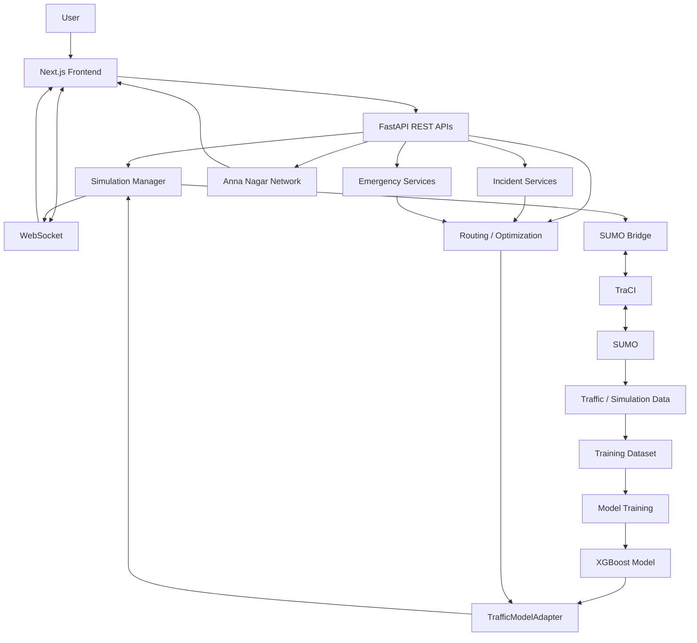
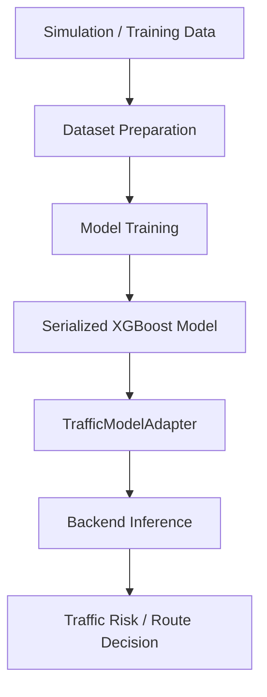

# Traffix

### Intelligent Traffic Simulation, Risk Prediction, Route Optimization & Real-Time Navigation

[](https://github.com/santhoshraja-15/Traffix/releases/tag/v1.1.0)
[](https://www.python.org/)
[](https://fastapi.tiangolo.com/)
[](https://nextjs.org/)
[](https://eclipse.dev/sumo/)
[](https://xgboost.readthedocs.io/)

> **Traffix is an integrated traffic-intelligence platform connecting traffic data acquisition, SUMO simulation, machine learning, backend services, route optimization, interactive mapping, live navigation, incident handling, and emergency response.**

## Table of Contents

- [Overview](#overview)
- [Problem Statement](#problem-statement)
- [Objectives](#objectives)
- [Key Features](#key-features)
- [Architecture](#architecture)
- [End-to-End Pipeline](#end-to-end-pipeline)
- [Data Acquisition](#data-acquisition)
- [SUMO and TraCI](#sumo-and-traci)
- [Machine Learning](#machine-learning)
- [Backend](#backend)
- [API and WebSocket](#api-and-websocket)
- [Frontend](#frontend)
- [Map and Navigation](#map-and-navigation)
- [Routing and Optimization](#routing-and-optimization)
- [Dynamic Rerouting](#dynamic-rerouting)
- [Incidents and Emergency Response](#incidents-and-emergency-response)
- [Technology Stack](#technology-stack)
- [Repository Structure](#repository-structure)
- [Installation](#installation)
- [Configuration](#configuration)
- [Running](#running)
- [Demo Workflow](#demo-workflow)
- [Verification and Release](#verification-and-release)
- [Team Contributions](#team-contributions)
- [Project Architecture by Ownership](#project-architecture-by-ownership)
- [Troubleshooting](#troubleshooting)
- [Limitations and Future Work](#limitations-and-future-work)
- [Contributing](#contributing)
- [Acknowledgements](#acknowledgements)
- [License](#license)

---

## Overview

Traffix treats intelligent routing as an end-to-end engineering problem rather than only a map or shortest-path problem.

The system connects:

```text
Traffic Data
    ↓
Data Preparation
    ↓
SUMO Simulation + TraCI
    ↓
Simulation Export
    ↓
ML Dataset
    ↓
Model Training
    ↓
Persisted Traffic-Risk Model
    ↓
FastAPI Backend
    ↓
REST APIs + WebSocket
    ↓
Next.js Frontend
    ↓
Map + Routing + Navigation
    ↓
Optimization / Rerouting
    ↓
Incident Handling
    ↓
Emergency / Ambulance Response
```

The integrated application operates on a real Anna Nagar, Chennai road network. The verified network loader reports **1,234 nodes and 3,187 edges**, while the SUMO bridge reports **3,245 discovered road edges**.

---

## Problem Statement

Static route planning can become inadequate when traffic conditions change during a journey. Traffix addresses this by combining simulated traffic state, learned traffic-risk information, route generation, optimization, active navigation, incident handling, and emergency routing in one system.

The project targets:

- congestion-aware decision making
- changing travel conditions
- route comparison
- traffic/risk-aware navigation
- incident impact
- emergency response
- real-time traffic visualization

---

## Objectives

1. Acquire and prepare traffic data.
2. Generate traffic conditions using SUMO.
3. Export simulation information for dataset creation.
4. Train traffic-related ML models.
5. Load trained models into the backend.
6. Provide REST and real-time services.
7. Generate and compare routes.
8. Optimize route selection using available traffic/risk information.
9. Visualize the real Anna Nagar network.
10. Provide live navigation and journey progress.
11. Handle accidents and route impact.
12. Support ambulance routing and green-corridor visualization.
13. Provide an integrated end-to-end traffic intelligence workflow.

---

## Key Features

| Feature | Description | Status |
|---|---|---|
| Traffic data acquisition | Upstream traffic-data collection and preparation | Implemented |
| SUMO simulation | Traffic simulation and scenario execution | Implemented |
| TraCI | Programmatic SUMO communication | Implemented |
| Dataset generation | Simulation output prepared for ML | Implemented |
| XGBoost risk model | Persisted Traffix model used during inference | Implemented |
| Anna Nagar network | Real road-network geometry | Implemented |
| Interactive map | Network, route and emergency visualization | Implemented |
| FROM/TO routing | Searchable origin/destination workflow | Implemented |
| Route comparison | Multiple route alternatives with traffic/risk information | Implemented |
| Route optimization | Traffic/risk-aware route selection | Implemented |
| WebSocket updates | Real-time backend/frontend state | Implemented |
| Active journey | Moving vehicle, progress and journey KPIs | Implemented |
| Dynamic rerouting | Active-route re-evaluation | Implemented |
| Accident workflow | Incident impact and user notification | Implemented |
| Ambulance workflow | Emergency dispatch and mission state | Implemented |
| Green corridor | Emergency-route visualization | Implemented |
| Recovery | Backend restart/reconnect and clean reload behavior | Implemented |
| Mapbox basemap | Token-based basemap path | Configurable |
| SVG network fallback | Real network rendering without a valid basemap token | Implemented |

---

# Architecture



### Architectural layers

| Layer | Responsibility |
|---|---|
| Data | Acquisition, preparation and simulation-derived data |
| Simulation | SUMO execution and TraCI communication |
| ML | Model training, serialization, loading and inference |
| Backend | APIs, simulation management, routing and emergency services |
| Real-time | WebSocket state propagation |
| Frontend | Map, controls, navigation and visualization |
| Decision | Route comparison, optimization, rerouting and incident response |

---

# End-to-End Pipeline

```mermaid
flowchart LR
    A[Traffic Acquisition] --> B[Preparation]
    B --> C[SUMO]
    C --> D[Simulation Export]
    D --> E[ML Dataset]
    E --> F[Training]
    F --> G[Persisted Model]
    G --> H[Backend Inference]
    C --> H
    H --> I[Route Generation]
    I --> J[Optimization]
    J --> K[Frontend Map]
    K --> L[Active Navigation]
    L <--> M[WebSocket Updates]
    M --> N[Incident / Emergency State]
    N --> J
```



The complete project pipeline is:

**DATA → SIMULATION → LEARNING → PREDICTION → OPTIMIZATION → VISUALIZATION → NAVIGATION**

---

# Data Acquisition

**Keshore G** owns the upstream data and training pipeline.

His contribution covers the complete chain:

```text
DATA ACQUISITION
      ↓
DATASET GENERATION
      ↓
SUMO SETUP
      ↓
SIMULATION EXECUTION
      ↓
SIMULATION DATA EXPORT
      ↓
DATASET PREPARATION
      ↓
TRAINING DATA
      ↓
MODEL TRAINING
```

This includes traffic-data acquisition, dataset generation, SUMO configuration and execution, simulation-output export, ML training-data preparation, preprocessing where applicable, and training models using acquired/generated traffic data.

The exact dataset schema should be treated as the source of truth in the repository's training artifacts; this README deliberately does not invent feature columns or benchmark values.

---

# SUMO and TraCI

Traffix uses **Eclipse SUMO 1.27.1** for traffic simulation and **TraCI** for programmatic communication.

### Verified network

- Area: Anna Nagar, Chennai
- Network file: `scenarios/medium/osm.net.xml.gz`
- Nodes: 1,234
- Application graph edges: 3,187
- SUMO bridge discovered edges: 3,245

The network loader reports 58 parallel edges skipped when building its graph representation because an equivalent `(from, to)` junction pair was already represented.

### Runtime

```text
Traffix
   ↓
SimulationManager
   ↓
SumoBridge
   ↓
TraCI
   ↓
SUMO
   ↓
Traffic State
```

When SUMO is unavailable, the backend can enter its documented mock/fallback mode. For full simulation behavior, SUMO must be correctly installed and discoverable.

---

# Machine Learning

Traffix uses a persisted XGBoost traffic-risk model.

Verified model artifact:

```text
app/ml/weights/traffix_xgboost_v15_risk_escalation.json
```

Verified runtime status:

```text
Model version : V15
Features      : 53
Threshold     : 0.96
Status        : LOADED
```

The backend loads it through `TrafficModelAdapter`.



**Keshore G** owns the upstream training pipeline; **Guruprasad V** owns backend-side model integration and inference.

No unsupported accuracy or performance numbers are claimed here.

---

# Backend

Traffix's backend is built with **FastAPI** and served through **Uvicorn**.

Entry point:

```text
app.main:app
```

Core modules include:

```text
app/
├── main.py
├── core/
│   └── simulation_manager.py
├── integrations/
│   ├── sumo_bridge.py
│   └── sumo_network_loader.py
└── ml/
    ├── ml_adapter.py
    └── weights/
```

The backend coordinates:

- application lifecycle
- ML model loading/inference
- simulation management
- SUMO/TraCI integration
- network data
- route services
- incidents
- emergency workflows
- REST APIs
- WebSockets

**Guruprasad V** owns the complete backend and ML-integration layer.

---

# API and WebSocket

Verified API paths include:

| Method | Endpoint | Purpose |
|---|---|---|
| `GET` | `/api/network/topology` | Anna Nagar network geometry |
| `GET` | `/api/network/locations` | Searchable road/location data |
| `POST` | `/api/simulation/start` | Initialize/start simulation |
| `GET` | `/api/emergency/hospitals` | Emergency/hospital information |
| `POST` | `/api/routes` | Route generation/comparison |
| `WS` | `/api/realtime/anna-nagar-live` | Real-time traffic/simulation state |

Additional accident, emergency and mission services are part of the integrated application; the backend source remains authoritative for their exact contracts.

### WebSocket lifecycle

```text
CONNECT
  ↓
INITIALIZE
  ↓
RECEIVE
  ↓
PARSE
  ↓
STORE STATE
  ↓
RENDER
  ↓
RECONNECT WHEN REQUIRED
```

---

# Frontend

The frontend uses **Next.js 16.3.1**, TypeScript and Turbopack in the verified development environment.

Relevant modules include:

```text
frontend/
├── components/
│   └── map/
│       └── TrafficMap.tsx
├── hooks/
│   └── useWebSocket.ts
├── lib/
│   └── constants.ts
└── services/
    ├── api.ts
    └── networkApi.ts
```

Frontend responsibilities include:

- interactive UI
- map/network rendering
- FROM/TO routing
- route visualization
- active navigation
- real-time updates
- journey progress
- incident visualization
- emergency visualization
- route optimization integration
- end-to-end user experience

**Santhoshraja S** owns the frontend, integration, optimization and final system refinement.

---

# Map and Navigation

Traffix visualizes the real Anna Nagar road network and supports:

- road-network rendering
- route geometry
- origin/destination
- hospital markers
- accident visualization
- ambulance marker/layer
- vehicle marker
- pan
- zoom
- fit-to-network
- fit-to-route
- camera following
- active journey visualization

### Active journey

```text
START
  ↓
Vehicle at origin
  ↓
Move along selected route
  ↓
Update progress
  ↓
Update distance / elapsed journey state
  ↓
Follow vehicle
  ↓
Destination
  ↓
ARRIVED
```

The active journey visualization was specifically hardened to provide a visible vehicle marker, movement, journey progress, camera-follow behavior and arrival state.

---

# Routing and Optimization

Traffix's routing flow is:

```text
FROM
 ↓
TO
 ↓
Location Validation
 ↓
Route Request
 ↓
Backend Processing
 ↓
Traffic / Risk Evaluation
 ↓
Route Alternatives
 ↓
Optimization
 ↓
Selected Route
 ↓
Map Rendering
 ↓
Navigation
```

The system exposes route alternatives and associated decision information to the frontend.

The project intentionally avoids claiming a mathematical objective function unless it is explicitly implemented in the source.

---

# Dynamic Rerouting

Traffix contains an active-route reoptimization workflow:

```text
ACTIVE ROUTE
    ↓
TRAFFIC / INCIDENT CHANGE
    ↓
CURRENT ROUTE RE-EVALUATION
    ↓
ALTERNATIVE ROUTE EVALUATION
    ↓
REROUTE DECISION
    ↓
FRONTEND ROUTE UPDATE
```

If no genuinely better alternative exists, the application reports that state rather than fabricating a faster route.

---

# Incidents and Emergency Response

## Accident workflow

```text
ACCIDENT
   ↓
Affected Edge
   ↓
Traffic / Risk Impact
   ↓
Route Evaluation
   ↓
User Notification
   ↓
Rerouting Decision
```

The incident is represented within the active network/route context.

## Ambulance workflow

```text
ACCIDENT
   ↓
Emergency Dispatch
   ↓
Hospital / Unit
   ↓
Emergency Route
   ↓
Green Corridor
   ↓
Accident Response
   ↓
Mission Progress
   ↓
Return / Completion
```

The frontend visualizes emergency state using ambulance and corridor layers together with mission information.

---

# Technology Stack

| Layer | Technology | Purpose |
|---|---|---|
| Frontend | Next.js | Web application |
| Frontend language | TypeScript | Application/UI logic |
| Backend | FastAPI | REST/API services |
| Server | Uvicorn | ASGI runtime |
| Simulation | Eclipse SUMO 1.27.1 | Traffic simulation |
| Simulation API | TraCI | SUMO communication |
| ML | XGBoost | Traffic-risk model |
| ML adapter | TrafficModelAdapter | Backend model loading/inference |
| Network | OpenStreetMap-derived SUMO network | Anna Nagar road network |
| Real-time | WebSocket | Live state propagation |
| Map | Mapbox configuration + SVG fallback | Map/network rendering |
| Package tooling | npm / Next.js tooling | Frontend build/development |
| Version control | Git / GitHub | Collaboration and release |

---

# Repository Structure

```text
Traffix/
├── app/                              # Backend (FastAPI) application
│   ├── api/                          # HTTP/WebSocket route handlers
│   ├── core/                         # Core simulation & config logic
│   │   └── simulation_manager.py
│   ├── emergency/                    # Emergency/ambulance green-corridor routing
│   ├── integrations/                 # Adapters over the legacy SUMO/TraCI/ML scripts
│   │   ├── sumo_bridge.py
│   │   └── sumo_network_loader.py
│   ├── ml/                           # Trained model artifacts + inference
│   │   ├── ml_adapter.py
│   │   └── weights/
│   │       └── traffix_xgboost_v15_risk_escalation.json
│   ├── models/                       # Pydantic/data models
│   ├── routing/                      # NetworkX/A*-based routing engine
│   ├── services/                     # Application services
│   ├── utils/                        # Shared utilities
│   ├── __init__.py
│   └── main.py                       # Backend entrypoint
│
├── frontend/                         # Next.js + TypeScript frontend
│   ├── app/                          # App-router pages
│   ├── components/                   # UI components
│   │   └── map/
│   │       └── TrafficMap.tsx
│   ├── context/                      # React context providers
│   ├── hooks/                        # Custom hooks
│   │   └── useWebSocket.ts
│   ├── lib/                          # Frontend utilities
│   │   └── constants.ts
│   ├── public/                       # Static assets
│   ├── services/                     # API/WebSocket client services
│   │   ├── api.ts
│   │   └── networkApi.ts
│   ├── styles/                       # Global styles
│   ├── types/                        # TypeScript types
│   ├── AGENTS.md
│   ├── CLAUDE.md
│   ├── FRONTEND_AUDIT.md
│   ├── FRONTEND_BUILD_INSTRUCTIONS.md
│   ├── FRONTEND_DESIGN_SYSTEM.md
│   ├── FRONTEND_FLOW.md
│   ├── FRONTEND_MASTER_PROMPT.md
│   ├── FRONTEND_PRD.md
│   ├── FRONTEND_TECHNICAL_DEEP_DIVE.md
│   ├── next.config.js
│   ├── package.json
│   ├── postcss.config.js
│   ├── readmefrontend.md
│   ├── tailwind.config.ts
│   └── tsconfig.json
│
├── docs/                             # Project documentation
│   ├── api.md
│   ├── architecture.md
│   ├── demo_script.md
│   ├── emergency_system.md
│   ├── frontend.md
│   ├── ml_pipeline.md
│   ├── routing.md
│   ├── setup.md
│   └── sumo_integration.md
│
├── scenarios/                        # SUMO traffic scenarios
│   ├── congested/
│   ├── high/
│   ├── low/
│   └── medium/
│       ├── osm.net.xml.gz
│       ├── edgeData.xml
│       ├── stats.xml
│       └── tripinfos.xml
│
├── tests/
│   ├── integration/
│   ├── scenarios/
│   ├── unit/
│   └── __init__.py
│
├── .venv/
├── .env.example
├── .gitattributes
├── .gitignore
├── PROJECT_AUDIT.md
├── README.md
├── requirements.txt
├── requirements-dev.txt
├── start_traffix.bat
├── traffix_live_risk.py
├── traffix_risk_router.py
├── traffix_road_collector.py
├── traffix_road_collector_v2.py
├── traffix_traci.py
├── traffix_v15_live.py
└── (dataset & model-preparation scripts: analyze_ml_dataset.py, analyze_traffic.py,
    analyze_xgboost_v11.py, calibrate_xgboost_v11.py, create_ml_dataset.py,
    create_prediction_dataset.py, create_scenarios.py, download_map.py,
    prepare_road_dataset.py, prepare_xgboost_dataset.py, prepare_xgboost_v2.py,
    prepare_xgboost_v3.py, run_road_scenarios.py, run_scenarios.py,
    train_xgboost_v1.py … train_xgboost_v15.py, validate_road_scenarios.py, ws_verify.py)
```

---

# Installation

## 1. Clone

```powershell
git clone https://github.com/santhoshraja-15/Traffix.git
cd Traffix
```

## 2. Python environment

```powershell
python -m venv .venv
Set-ExecutionPolicy -Scope Process -ExecutionPolicy RemoteSigned
.\.venv\Scripts\Activate.ps1
```

Install the backend dependencies specified by the repository.

## 3. SUMO

Install Eclipse SUMO and make `sumo.exe` available on `PATH`.

Verify:

```powershell
where.exe sumo
where.exe sumo-gui
```

Both should return executable paths.

## 4. Frontend

```powershell
cd frontend
npm install
```

---

# Configuration

The frontend uses:

```env
NEXT_PUBLIC_API_URL=<backend>/api
NEXT_PUBLIC_WS_URL=<backend>/api
NEXT_PUBLIC_API_ORIGIN=<backend>
NEXT_PUBLIC_MAP_TOKEN=<your-mapbox-token>
```

For a backend running on port `8010`:

```env
NEXT_PUBLIC_API_URL=http://localhost:8010/api
NEXT_PUBLIC_WS_URL=ws://localhost:8010/api
NEXT_PUBLIC_API_ORIGIN=http://localhost:8010
NEXT_PUBLIC_MAP_TOKEN=<your-valid-mapbox-token>
```

Never commit real API keys or private tokens.

After changing `.env.local`, restart the Next.js development server.

---

# Running

Use separate terminals.

### Terminal 1 — Backend

From the repository root:

```powershell
.\.venv\Scripts\Activate.ps1
.\.venv\Scripts\python.exe -m uvicorn app.main:app --host 127.0.0.1 --port 8010
```

A  startup should report model loading and, when SUMO is configured correctly, messages similar to:

```text
TrafficModelAdapter ... [LOADED]
SumoBridge connected
SUMO mode active
Uvicorn running on http://127.0.0.1:8010
```

### Terminal 2 — Frontend

```powershell
cd frontend
npm run dev
```

Open the URL printed by Next.js.

### SUMO

SUMO is normally controlled through the application's SUMO/TraCI integration. If the backend reports:

```text
[WinError 2] The system cannot find the file specified
```

for `traci.start`, fix SUMO discovery/PATH before expecting live SUMO mode.

---

# Demo Workflow

A strong final demonstration is:

1. Start SUMO/backend and confirm TraCI connection.
2. Start the frontend.
3. Show the real Anna Nagar network.
4. Enter FROM and TO locations.
5. Generate route alternatives.
6. Select the preferred route.
7. Start the journey.
8. Demonstrate vehicle movement and route progress.
9. Show elapsed journey/distance KPIs.
10. Demonstrate camera follow, pan and zoom.
11. Trigger an accident scenario.
12. Show route/risk impact.
13. Demonstrate ambulance dispatch.
14. Show the emergency route and green corridor.
15. Complete the emergency mission.
16. Optionally demonstrate backend restart and automatic frontend recovery.

---

# Verification and Release

The final integration was verified beyond compilation/page-load checks.

Verified areas include:

- FastAPI startup
- V15 XGBoost model loading
- real Anna Nagar network loading
- SUMO / TraCI connection
- REST APIs
- WebSocket lifecycle
- map rendering
- map pan/zoom
- route generation
- navigation
- vehicle movement
- journey progress
- accident impact
- ambulance workflow
- green corridor
- backend restart/reconnect
- page-refresh recovery
- TypeScript checks
- production build

The release history includes:

```text
2bf4539  Final release hardening
752cdb7  Bound unprotected frontend fetch calls
b2ca427  Map camera / pan / zoom fixes
1d71497  Journey progress and elapsed-time fixes
9a4f03e  Active journey visualization
31eb96d  Merge frontend-rebuild into main
```

Current integrated release:

```text
v1.1.0
```

---

# Team Contributions

## Keshore G

### Data Acquisition · SUMO · Dataset Generation · Model Training

Keshore G owns the complete upstream data-to-training pipeline:

- traffic data acquisition
- dataset generation
- SUMO setup
- SUMO network/simulation workflow
- traffic simulation execution
- SUMO configuration
- simulation-data export
- preparation of simulation output for ML
- data preprocessing where applicable
- training-dataset preparation
- ML training-data generation
- model training using acquired/generated traffic data
- supporting the complete simulation → dataset → training pipeline

His ownership is therefore:

```text
DATA
 ↓
SUMO
 ↓
EXPORT
 ↓
DATASET
 ↓
TRAINING
 ↓
MODEL
```

This is substantially broader than simply collecting traffic data.

---

## Guruprasad V

### Backend · ML Integration · APIs · Real-Time Services

Guruprasad V owns the complete backend and backend-side ML integration:

- FastAPI backend architecture
- backend services
- API implementation
- ML model integration
- model loading
- ML inference
- traffic/risk prediction services
- simulation/backend integration
- frontend/backend communication
- WebSocket implementation
- real-time state handling
- backend processing
- route-related backend services
- incident/emergency backend workflows
- connecting trained models and simulation state to application services

His ownership forms:

```text
SUMO + Trained Models
        ↓
Backend
        ↓
REST APIs + WebSocket
        ↓
Frontend
```

---

## Santhoshraja S

### Frontend · Integration · Optimization · Navigation · System Refinement

Santhoshraja S owns the frontend and final system-integration layer:

- frontend architecture and implementation
- Next.js/TypeScript integration
- frontend/backend integration
- interactive UI
- map integration
- Anna Nagar network visualization
- FROM/TO routing interface
- route visualization
- route optimization integration
- traffic-aware route handling
- dynamic route handling
- navigation UI
- WebSocket frontend integration
- real-time UI updates
- active vehicle/journey visualization
- journey progress
- camera follow, pan and zoom behavior
- accident visualization
- ambulance visualization
- green-corridor visualization
- backend-result integration
- UI/UX refinement
- performance/reliability improvements
- bug fixing and integration fixes
- end-to-end verification
- final system polishing and release integration

His ownership forms:

```text
Backend + ML + SUMO
        ↓
Frontend Integration
        ↓
Map + Routing + Navigation
        ↓
Optimization + Incidents
        ↓
Emergency Visualization
        ↓
Complete Traffix Experience
```

---

# Project Architecture by Ownership

| System Layer | Primary Contributor |
|---|---|
| Data Acquisition | Keshore G |
| SUMO Simulation | Keshore G |
| Simulation Export | Keshore G |
| Dataset Generation | Keshore G |
| Model Training | Keshore G |
| Backend | Guruprasad V |
| ML Integration | Guruprasad V |
| ML Inference | Guruprasad V |
| API Layer | Guruprasad V |
| Real-Time Backend | Guruprasad V |
| WebSocket Backend | Guruprasad V |
| Frontend | Santhoshraja S |
| Map Integration | Santhoshraja S |
| Route Visualization | Santhoshraja S |
| Route Optimization | Santhoshraja S |
| Navigation | Santhoshraja S |
| Active Journey | Santhoshraja S |
| Emergency Visualization | Santhoshraja S |
| End-to-End Integration | Santhoshraja S |
| Final Optimization / Refinement | Santhoshraja S |

---

# Troubleshooting

| Problem | Cause | Solution |
|---|---|---|
| `WinError 2` from `traci.start` | SUMO executable not found | Install SUMO and verify `where.exe sumo` |
| `SumoBridge.connect` failed | SUMO/TraCI unavailable | Fix SUMO installation/PATH and restart backend |
| Backend starts in mock mode | SUMO unavailable | Configure SUMO for complete simulation |
| Port already in use | Another process owns the port | Check `netstat -ano \| findstr :8010` and use a free port |
| Frontend cannot reach backend | URL/port mismatch | Align API/WS environment variables with backend port |
| Map stays loading | Backend unavailable/hanging | Verify backend and API origin |
| Mapbox basemap unavailable | Token missing/invalid | Configure `NEXT_PUBLIC_MAP_TOKEN`; SVG fallback rendering may remain available |
| `where.exe sumo` returns nothing | SUMO not on PATH | Add SUMO's `bin` directory to PATH |
| Port 3000 occupied | Existing Next.js process | Stop it, or use the port Next.js prints |
| WebSocket disconnects | Backend stopped/wrong WS URL | Check backend and WS origin; restart frontend if environment changed |
| Model loading fails | Model artifact/path issue | Confirm `app/ml/weights/traffix_xgboost_v15_risk_escalation.json` exists |
| Environment changes ignored | Next.js server still running | Stop and restart `npm run dev` |

---

# Limitations and Future Work

**Current release considerations:**

- SUMO must be installed/configured for live SUMO/TraCI mode.
- Mapbox basemap rendering requires a valid token; the application provides a network/SVG fallback path.
- Local API and WebSocket origins must match the backend port.
- Simulation behavior depends on the configured SUMO scenarios and network.
- The included persisted model represents the released model artifact.
- Formal ML benchmark numbers should only be added from reproducible evaluation artifacts.
- **Traffic signal control is unavailable** — there is no `traci.trafficlight.*` call anywhere in the codebase; the emergency "green corridor" is route-priority only and does not change any real signal (disclosed directly in-app, `app/emergency/mission_manager.py`).
- **Physical IoT camera/sensor integration is unavailable** — this deployment has no physical camera or roadside sensor hardware to monitor; all traffic data comes from the SUMO simulation (or real TraCI, when connected), disclosed directly in-app on the Features page.

**Potential future directions:**

- larger real-world traffic datasets
- broader geographic coverage
- online/incremental learning
- improved traffic prediction
- multi-objective optimization
- stronger incident prediction
- scalable/distributed simulation
- cloud deployment
- mobile navigation
- historical traffic analytics
- personalized routing
- larger-scale real-time infrastructure
- expanded emergency-response optimization

---

# Contributing

```text
Create Branch
     ↓
Implement
     ↓
Test
     ↓
Live Verify
     ↓
Commit
     ↓
Push
     ↓
Pull Request
     ↓
Review
     ↓
Merge
```

For changes to simulation, ML, APIs, WebSockets or routing, verify the actual runtime behavior rather than relying only on compilation.

For frontend changes, test the complete user-visible workflow.

---

# Acknowledgements

Traffix builds on:

- **Eclipse SUMO** — traffic simulation
- **TraCI** — SUMO programmatic interface
- **OpenStreetMap-derived network data** — road-network foundation
- **FastAPI** — backend API framework
- **Uvicorn** — ASGI server
- **Next.js** — frontend framework
- **TypeScript** — type-safe frontend development
- **XGBoost** — machine-learning model
- **Git / GitHub** — source control and collaboration

---

# License

A formal repository license should be defined in a dedicated `LICENSE` file.

> **License has not been explicitly specified in this README.**

---

## Traffix v1.1.0

```text
DATA
  ↓
SIMULATION
  ↓
LEARNING
  ↓
PREDICTION
  ↓
OPTIMIZATION
  ↓
VISUALIZATION
  ↓
NAVIGATION
  ↓
EMERGENCY RESPONSE

             TRAFFIX
```

**An integrated traffic-intelligence, simulation, prediction, optimization and navigation platform.**
